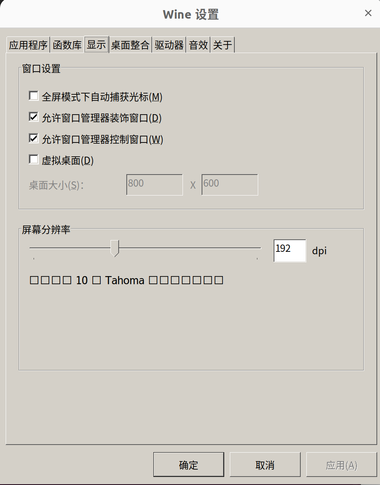

# 安装微信
微信（WeChat） 是一个为智能终端提供即时通讯服务的免费应用程序。支持跨通信运营商、跨操作系统平台通过网络快速发送免费（需消耗少量网络流量）语音短信、视频、图片和文字，同时，也可以使用通过共享流媒体内容的资料和基于位置的社交插件“摇一摇”、“朋友圈”、”公众平台“、”语音记事本“等服务插件。
### 1.下载Wine环境包：
```
Wine环境包下载地址：http://archive.ubuntukylin.com/software/pool/partner/ukylin-wine_70.6.3.25_amd64.deb
```
### 2.下载微信（wine）包：
```
微信（wine）包下载地址：http://archive.ubuntukylin.com/software/pool/partner/ukylin-wechat_3.0.0_amd64.deb
```
### 3.终端输入：
```sh
sudo apt-get install -f -y ./ukylin-wine_70.6.3.25_amd64.deb
sudo apt-get install -f -y ./ukylin-wechat_3.0.0_amd64.deb
```

# ubuntu22.04 修改wechat分辨率

```sh
WINEPREFIX=~/.ukylin-wine/wechat  /usr/bin/ukylin-wine  winecfg
```
上面命令执行 之后，会弹出一个窗口。


在弹出的窗口中, 最上方选择"显示"，修改屏幕分辨率至合适值后重启应用即可。


